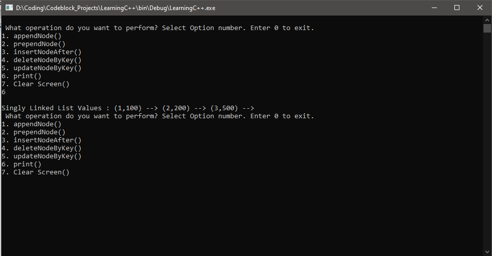

# DataStructuresImplemented
Many visual programs that will help understand the implementations of the data structures and algorithims.

This is meant for practice to actually see the DS&A in action.

The language used is C++ and uses the command line instead of a GUI.

here is a example of how each of the programs would look like when running.

